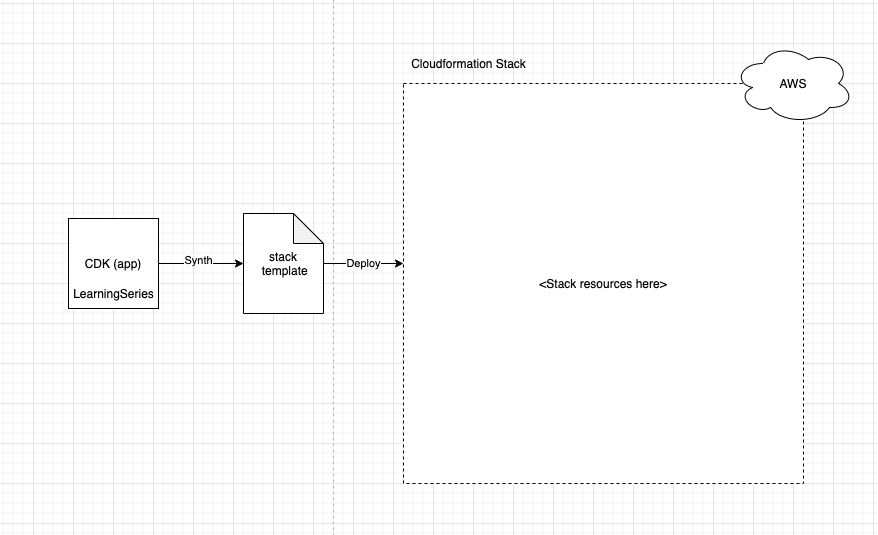
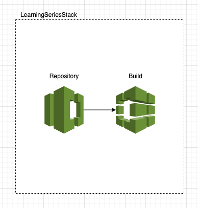
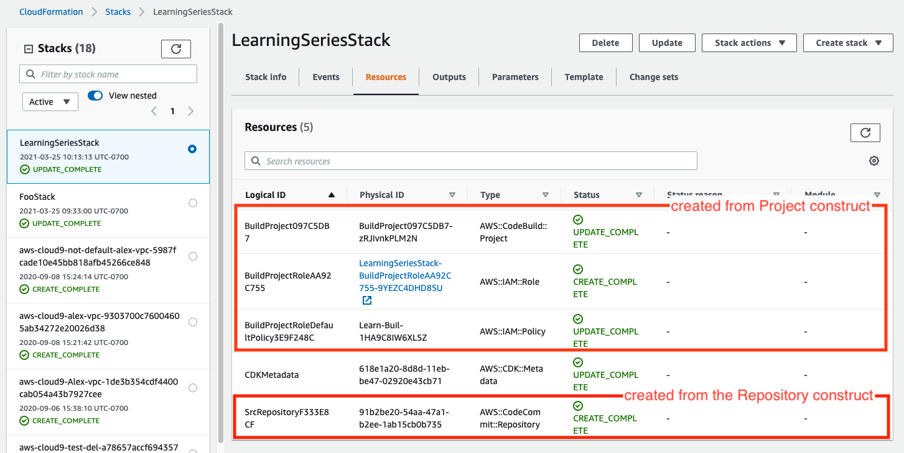

# CDK-learning-series
A learning series talk on my experience building infrastructure with AWS CDK

## Part 1: How it works

### Project Structure
```
.
|-- cdk.json // The configuration settings of the application:
|-- src
|   `-- bin
|       `-- cdk.ts // The entry point of your CDK application 
|-- tsconfig.base.json // Provides the typescript rules for the project.
`-- tsconfig.json // Extends `typescript.base.json` to use project rules and applies it to a src location
```

### Deploying a CDK app
When invoking `cdk deploy` in the command line. The CLI will use the features defined in your `cdk.json` under `context` you can learn more about [here](https://github.com/aws/aws-cdk/blob/master/packages/@aws-cdk/cx-api/lib/features.ts)
The CDK will invoke the command that is defined on the `app` property in our case using `ts-node` as an executable to run our cdk app located at the entry point
`src/bin/cdk.ts`. It will deploy by using your aws credentials located in `~/.aws/credentials` 

#### Bootstrapping

This process only occurs under certain criteria depending on where this application
is being deployed to. You can find out more about this [here](https://docs.aws.amazon.com/cdk/latest/guide/bootstrapping.html)

#### Output
You will notice a `cdk.out` directory that is created when running `cdk deploy`. This is the cloud formation templates that are generated as part of this workflow
We have created a LearningSeriesStack, which will hold the scope of our Cloudformation constructs



### Additional information on CDK basics
[learn more here](https://docs.aws.amazon.com/cdk/latest/guide/apps.html)

## Part 2: CDK Constructs

### Application (App)
The root of our CDK application. This is the construct that drives the
creation in this of a single LearningSeriesStack that encapsulates the constructs within it

### Stack (LearningSeriesStack)
The LearningSeriesStack is where we define the initial constructs that make up the components
of the CDK app.

### Constructs (SrcRepository, BuildProject)
The Stack has two constructs a src repository, and a build project.  The code commit source repository feeds into the
build project in order to do work against it.





### Stack Encapsulation
In order for a stack to hold ownership of constructs. It needs to know the context in which these constructs are created.
The CDK does this by accepting a scope (`this`) argument as the first parameter to each construct. This is a ubiquitous trait of all classes
that extend the Construct class.
