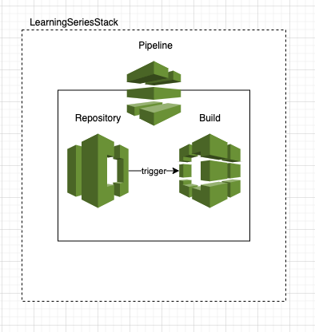
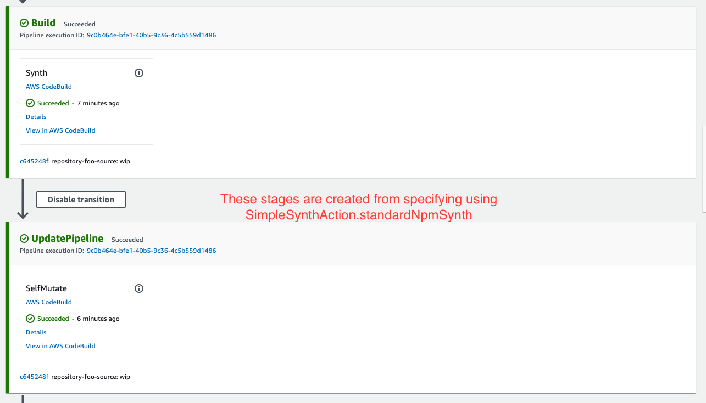

# CDK-learning-series
A learning series talk on my experience building infrastructure with AWS CDK

## Part 1: How it works

### Project Structure
```
.
|-- cdk.json // The configuration settings of the application:
|-- src
|   `-- bin
|       `-- cdk.ts // The entry point of your CDK application 
|-- tsconfig.base.json // Provides the typescript rules for the project.
`-- tsconfig.json // Extends `typescript.base.json` to use project rules and applies it to a src location
```

### Deploying a CDK app
When invoking `cdk deploy` in the command line. The CLI will use the features defined in your `cdk.json` under `context` you can learn more about [here](https://github.com/aws/aws-cdk/blob/master/packages/@aws-cdk/cx-api/lib/features.ts)
The CDK will invoke the command that is defined on the `app` property in our case using `ts-node` as an executable to run our cdk app located at the entry point
`src/bin/cdk.ts`. It will deploy by using your aws credentials located in `~/.aws/credentials` 

#### Bootstrapping

This process only occurs under certain criteria depending on where this application
is being deployed to. You can find out more about this [here](https://docs.aws.amazon.com/cdk/latest/guide/bootstrapping.html)

#### Output
You will notice a `cdk.out` directory that is created when running `cdk deploy`. This is the cloud formation templates that are generated as part of this workflow
We have created a LearningSeriesStack, which will hold the scope of our Cloudformation constructs


### Additional information on CDK basics
[learn more here](https://docs.aws.amazon.com/cdk/latest/guide/apps.html)

## Part 2: CDK Constructs

### Application (App)
The root of our CDK application. This is the construct that drives the
creation in this of a single LearningSeriesStack that encapsulates the constructs within it

### Stack (LearningSeriesStack)
The LearningSeriesStack is where we define the initial constructs that make up the components
of the CDK app. 

### Constructs (SrcRepository, BuildProject)
The Stack has two constructs a src repository, and a build project.  The code commit source repository feeds into the
build project in order to do work against it. 


### Stack Encapsulation
In order for a stack to hold ownership of constructs. It needs to know the context in which these constructs are created.
The CDK does this by accepting a scope (`this`) argument as the first parameter to each construct. This is a ubiquitous trait of all classes
that extend the Construct class.

## Part 3: Adding a pipeline
In Part 2 we created two CDK constructs. A repository and a BuildProject in order to show how a Stack encapsulates
constructs you put within it but it's not very useful. The repository is empty, and we didn't give codebuild a
way to do anything with that repository. In order to make this more useful we'll add a pipeline to handle the orchestration
of triggering a run so that we may feed src code changes into a buildProject to do work. Our stack will now
look something like this.



However, there is another problem. We need to initialize our repository with code. Declarative expressing using the CDK is currently not
possible. (At least not that I know of). So this project is fitted with a script in order to initialize a code commit repository which
is then used in our CDK Stack through `Repository.fromRepositoryName` you can run this script as follows `sh ./scripts/init`

### Construct Types:

Now is a good time to talk about the construct types. Constructs can offer be referred to by L1, L2, and L3 this is a discription given
to set the expectations of scope for a construct. For example L1 constructs are exactly the resources defined by AWS CloudFormation—no more, no less.
L2 level constructs are what we have been operating with, they are higher levels of abstraction that typically provide sensible defaults
to L1 constructs in order to do something typical.

## Part 4: Changing the pipeline to use the CDKPipeline construct
The CDK pipeline is a higher level of abstraction over the earlier pipeline construct. It offers the ability to rebuild
your infrastructure using the `synthAction` property. Where as before we were manually running cdk deploy in our terminal.



`SimpleSynthAction.standardNpmSynth` adds the following 2 stages in our pipeline. We have also created a new artifact called
`cloudAssemblyArtifact`. Remember in part one we spoke about the cdk.out directory. This artifact is used to capture these templates when we `synth` 
so that the pipeline may re-deploy our new infra changes, when changes are detected. 